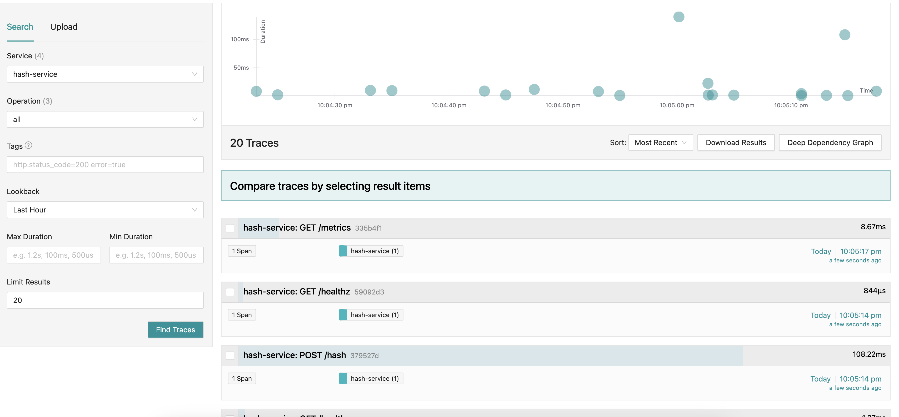
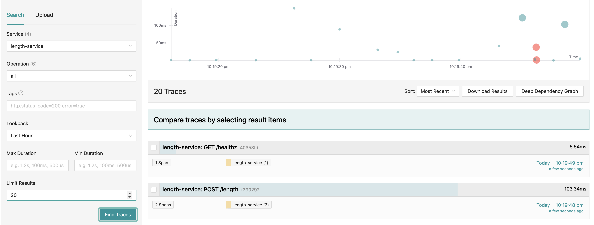
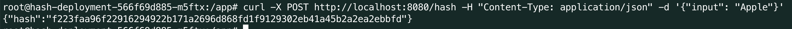
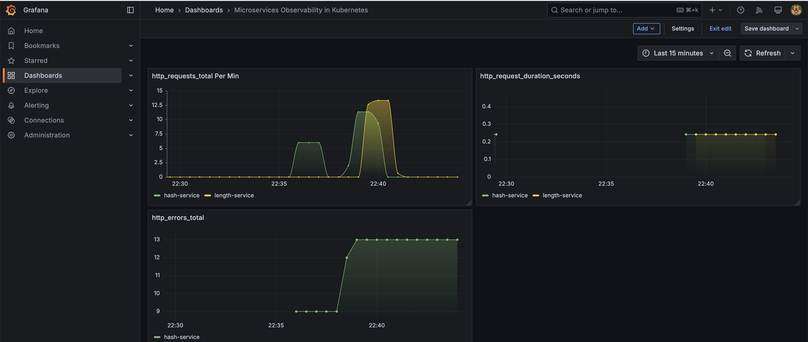
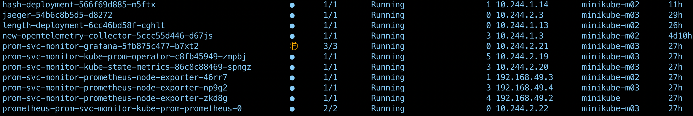

# Microservices Observability in Kubernetes

## Overview

This project demonstrates a simple two-service microservices application deployed on Kubernetes with basic observability practices, including monitoring and tracing. The application consists of:

- **Hash Service** - Computes the SHA256 hash of an input string.
- **Length Service** - Returns the length of an input string.

Both services are instrumented with OpenTelemetry for request tracing and expose basic metrics for Prometheus.

## Architecture

The application is structured as follows:

- **Hash Service** (port 8080)
- **Length Service** (port 8081)
- **Jaeger** for distributed tracing
- **Prometheus** for metrics collection
- **Kubernetes Deployments & Services** for container orchestration

## Prerequisites

Ensure you have the following installed:

- Docker
- Minikube or kind
- kubectl
- Helm

## Setup Instructions

### Step 1: Start Kubernetes Cluster

```bash
minikube start
```
### Step 2: Deploy Observability Stack

## Deploy Jaeger

 ``` bash
helm repo add jaegertracing https://jaegertracing.github.io/helm-charts
helm repo update
helm install jaeger jaegertracing/jaeger -f ./k8s/jaeger.yaml -n devops
```

## Deploy Prometheus

``` bash
helm repo add prometheus-community https://prometheus-community.github.io/helm-charts
helm repo update
helm install prom-svc-monitor prometheus-community/kube-prometheus-stack -n devops
```

## Deploy opentelemetry-collector

``` bash
helm repo add open-telemetry https://open-telemetry.github.io/opentelemetry-helm-charts
helm repo update
helm upgrade -i new open-telemetry/opentelemetry-collector \
     --namespace devops \
     --values ./k8s/otel.yaml \
     --set image.repository="otel/opentelemetry-collector-k8s"
```

## Step 3: Deploy Application Services

### Build and Push Docker Images

``` bash
docker build -t docker.io/alialhjouj/hash ./hash-service
docker build -t ldocker.io/alialhjouj/length ./length-service
```

``` bash
docker push docker.io/alialhjouj/hash 
docker push docker.io/alialhjouj/length
```

### Apply Kubernetes Manifests


``` bash
kubectl apply -f ./hash-service/k8s/
kubectl apply -f ./length-service/k8s/
```

## Step 4: Test the Services

``` bash
curl -X POST http://localhost:8080/hash -H "Content-Type: application/json" -d '{"input": "Apple"}'

curl -X POST http://localhost:8081/length -H "Content-Type: application/json" -d '{"input": "Apple"}'

```

## Observability Implementation

OpenTelemetry Tracing

Each service is instrumented with OpenTelemetry SDK to generate traces.
Traces are exported to Jaeger for visualization.
Prometheus Metrics

Basic request metrics (count, duration, errors) are collected and exposed at /metrics endpoint.
Prometheus scrapes these metrics from services.

## A sample trace in Jaeger 





## Example Request Flow


**Returns: 5**


**Returns: "f223faa96f22916294922b171a2696d868fd1f9129302eb41a45b2a2ea2ebbfd"**

## Basic metrics in Prometheus



## Running services

